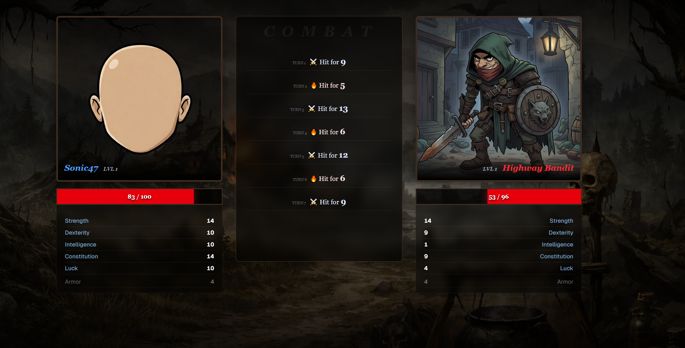
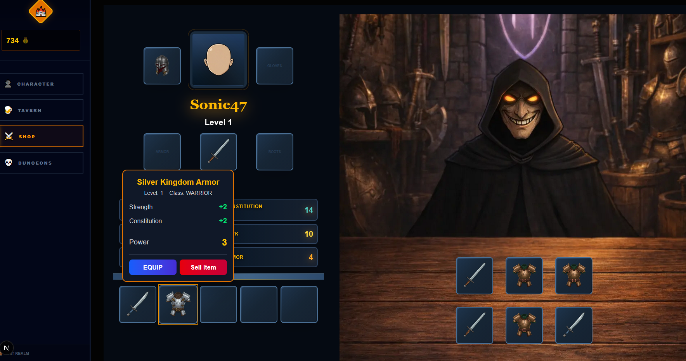
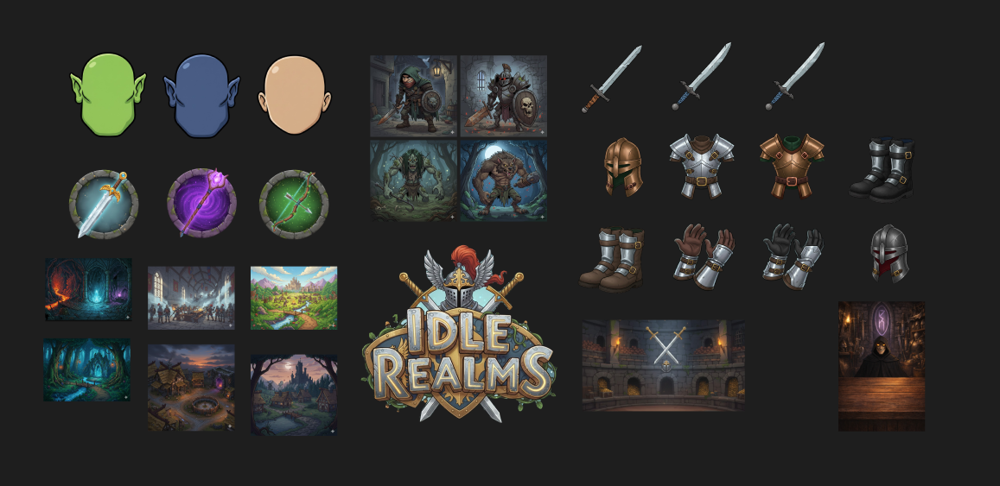

# Idle Realms

### 🚧 Project Status: Work In Progress

The project is not yet deployed, but the majority of core systems have already been implemented or are nearing completion.
Some visual assets are still placeholders, certain UI elements require additional refinement, and currently only the Warrior class has dedicated UI assets. Dungeon and mission balance is also undergoing final adjustments.

<div align="center">
  A strategic web-based RPG odyssey inspired by the legendary mechanics and charm of Shakes & Fidget.
</div>

---

## Overview

**Idle Realms** is a modern, web-based Idle RPG that breathes new life into the classic incremental genre. Inspired by the addictive progression loops of nostalgic browser games and the strategic depth of fantasy RPGs, this project was created to deliver a seamless, near "zero-latency" gameplay experience optimized for the modern web.

The game focuses on strategic character development, mission-based progression, and long-term optimization systems — combining idle mechanics with traditional RPG combat design.

<div align="center">
  
  
</div>

---

## Technologies

### Frontend

<div align="center">
  
  
  
  
  
</div>

### Assets & Design

- **Figma** – UI/UX design and layout prototyping  
- **Google Gemini** – AI-generated card and item illustrations (consistent prompt strategy)

---

## UI / Graphics

All visual illustrations were generated using **Google Gemini**, with carefully structured prompts to maintain a unified and coherent art style across the entire project.



---

## 📁 Project Structure

```
app/
├── components/          # Reusable UI components
├── hooks/               # Custom React hooks
├── login/               # Login page logic and components
├── providers/           # Context providers (Redux, QueryClient, etc.)
├── realm/               # Main game world / map logic
├── register/            # Registration page logic
├── services/            # API calls and data fetching logic
├── store/               # Global state configuration
├── types/               # TypeScript interfaces and types
├── globals.css          # Global styles and Tailwind imports
├── layout.tsx           # Main application shell
└── page.tsx             # Landing / Home page
```

---

## Current Features

- Character creation system  
- Item shop (buying & selling mechanics)  
- Persistent account progression  
- Tavern quest system  
- NPC combat system  
- Daily stamina system  
- Daily shop refresh mechanic  

---

## Roadmap (Planned Improvements)

- Dungeon expansion & balance adjustments  
- UI/UX polish and animation improvements  
- Additional character classes  
- Equipment rarity tiers & advanced item stats  
- Achievement system  

---

<div align="center">
  ⭐ Star this repository if you enjoyed the project!
</div>